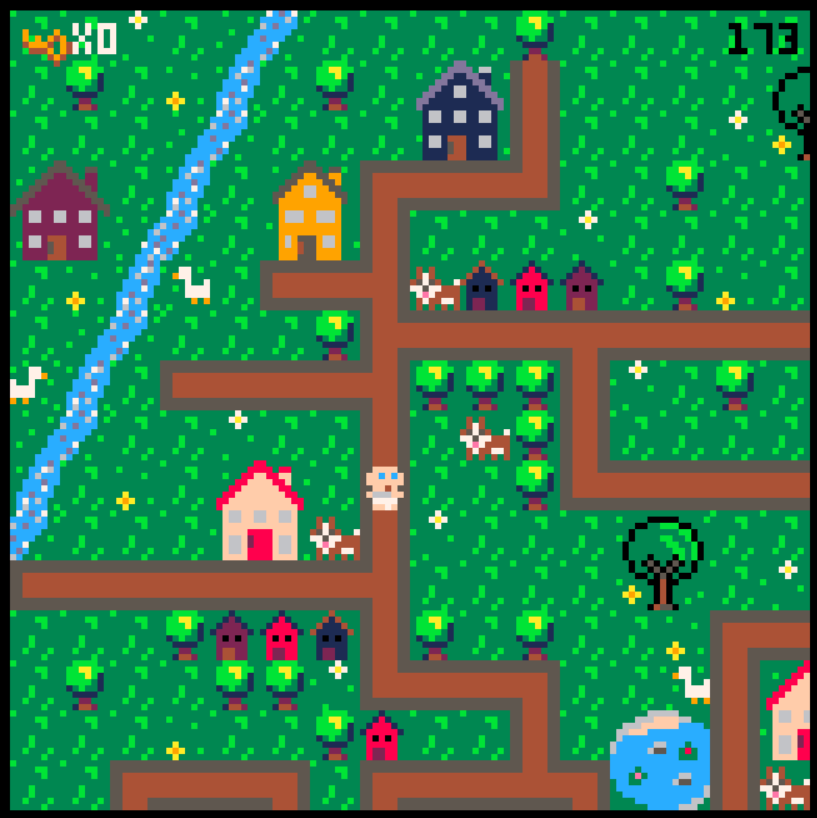
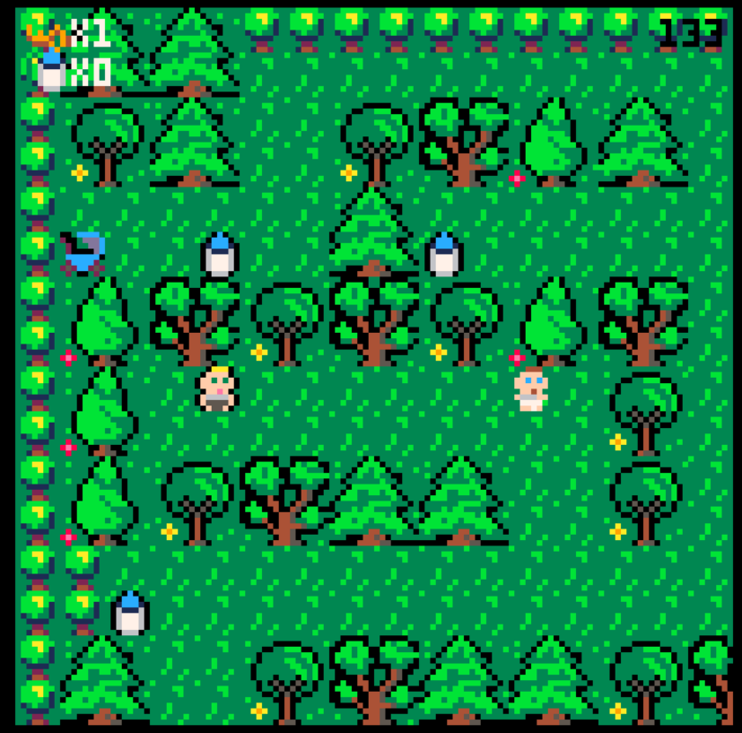
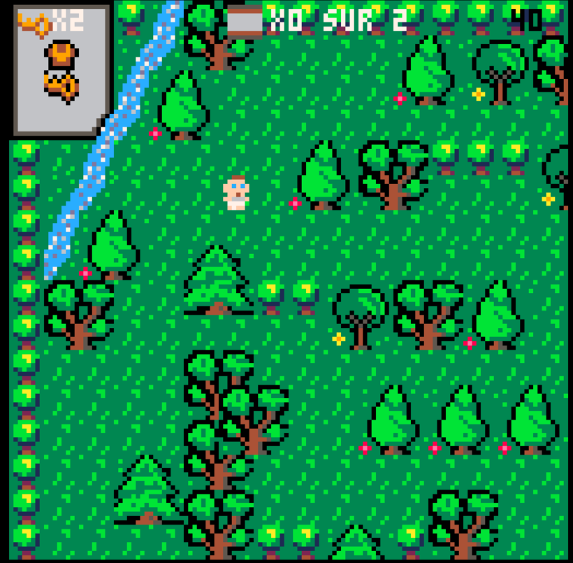

# projet-pico-8
Projet de jeu vidéo créé en groupe lors d'un sprint de deux semaines avec Pico-8, après quatre semaines de formation à [Ada Tech School - l'école qui casse les codes !](https://adatechschool.fr/ )

Lien vers le jeu : https://www.lexaloffle.com/bbs/?tid=50014
